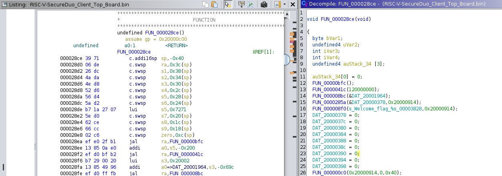

# GreHack22 - SecureDUO
The RISC-V challenges are splitted into 3 differents challs with dangerous steps between them ;)  
Every challs are based on the hydrausb board with WCH CH569 MCU. [hydrausb](https://github.com/hydrausb3/hydrausb3_fw)  
Thanks to Benjamin Vernoux for da military boards [bvernoux](https://github.com/bvernoux).

## Setup
> You need a clean and nice ghidra workspace setup before beginning.

Requirements:
- Download Ghidra 10.2.2 (at least)
- Download MounRiver Studio + toolchain [link](http://www.mounriver.com/download)
- Clone svd-loader [link](https://github.com/leveldown-security/SVD-Loader-Ghidra)
- The SVD file for CH569 (CH56Xxx.svd provided), this file is comming from the MounRiver
- Coffee(s)

Then, you have to:
- Import  binary (RISC-V-SecureDuo_Client_Top_Board.bin) and select RISC-V 32 little base compressed as language (RV32IC).
- Open with ghidra but do not analyse.
- Disassemble the first line (00000000) to get the entry point adress.
  
- In the entry point function, there is some data initialization:

      undefined4 *puVar1;
      undefined4 *puVar2;
      
      puVar1 = &DAT_00003f24;
      puVar2 = (undefined4 *)&DAT_20000000;
      // data segment init (sram)
      do {
        *puVar2 = *puVar1;
        puVar1 = puVar1 + 1;
        puVar2 = puVar2 + 1;
      } while (puVar2 < &DAT_20000418);
      puVar1 = (undefined4 *)&DAT_20000418;
      // bss segment init (sram)
      do {
        *puVar1 = 0;
        puVar1 = puVar1 + 1;
      } while (puVar1 < (undefined4 *)0x20002978);
      puVar1 = (undefined4 *)&DAT_20020000;
      // RAMX segment init (sram high speed)
      do {
        *puVar1 = 0;
        puVar1 = puVar1 + 1;
      } while (puVar1 < (undefined4 *)0x20024200);

Map those segments in Ghidra with the Memory Map tool  
  
  
  
- Map the peripherals with the SVD-Loader script and the file CH56Xxx.svd.  
  
- Set the Global Pointer or you will see the following message in the decompiler windows:  
  
- Select All the Code (Ctrl-A) and select "Set Register Values" in the menu  
- Set gp(32) according to the following formula (from bvernoux slides):  
  
  
- Launch the binary auto analyse from Ghidra with the Agressive Instruction Finder.  

After this, every functions must be easier to understand thanks to the decompiler (and our bvernoux).

## SecureDUO - 1
A binary is provided, you need to find the first flag hidden into.  
If your setup is good enough, you should see in the first function, a call to another function with the parameter "Welcome flag %s\n".  
  
The second parameter of the function is a pointer used in the previous function (FUN_0000285a).  
This function returns a xored data segment with the value 0x50.

Running this little script, give us the first (not so easy) flag:

    f = open("RISC-V-SecureDuo_Client_Top_Board.bin", "rb")
    baaf = f.read()
    f.close()
    
    flag = ""
    buf = baaf[0x3f24+0x378:]
    i = 0
    while buf[i]:
        flag += chr(buf[i] ^ 0x50)
        i += 1
    
    print(flag) # GH22{Welcome_t0_ReVerSe_0n_RISC-V}

## SecureDUO - 2
This time, there is no binary to analyse, because it is the same binary but the goal is to unlock the USB CMD function.

The "USB CMD locked" string can be found with Ghidra, and the reference to this string is pointing on this function:

      ... 
      if (DAT_20000480 == 0) {
        uVar7 = 0xf0a01300;
        if (pUVar9 == (USBHS *)0xf0a01300) {
          pcVar4 = (char *)param_3;
          FUN_000008f0(&DAT_00003e30,(uint)param_2,param_3,param_4,0xf0a01300,0xf0a01300,param_5,param_6
                      );
          uVar3 = FUN_0000244a((byte *)(param_2 + 1));
          uVar3 = FUN_000008f0(&DAT_00003e34,uVar3,pcVar4,param_4,uVar7,pUVar9,param_5,param_6);
          goto LAB_000025fe;
        }
        pcVar2 = s_USB_CMD_locked_00003e38;
        pcVar4 = (char *)0x10;
      }
      ... 
    

> The DAT_20000480 value must be set to 1 to unlock the USB CMD.  
> A specific header is waited in the USB buffer to enter in the special function below.  
> FUN_000008f0 is a function sending log to UART1.  
> The function to reverse to unlock this command is the one between the 2 log functions (FUN_0000244a).  

Reverse of the unlock function:
The DAT_20000480 value is written in this function at the end, so we are in the good place to unlock the USB CMD.

    ...
    uVar7 = 0x3d7fc4e1;
    puVar6 = &DAT_00003a34;
    puVar8 = &DAT_20000514;
    uVar5 = uVar7;
    while( true ) {
      *puVar8 = uVar7 ^ uVar5;
      uVar5 = uVar5 + 1;
      puVar8 = puVar8 + 1;
      if (uVar5 == 0x3d7fc5e1) break;
      uVar7 = *puVar6;
      puVar6 = puVar6 + 1;
    }
    pbVar9 = param_1 + 8;
    uVar5 = 0;
    do {
      bVar1 = *param_1;
      param_1 = param_1 + 1;
      uVar5 = (&DAT_20000514)[(bVar1 ^ uVar5) & 0xff] ^ uVar5 >> 8;
    } while (pbVar9 != param_1);
    if (uVar5 == 0xc87ef546) {
      DAT_20000470 = 0x50415353;
      DAT_20000474 = uVar5;
      cVar3 = FUN_000023c2(&DAT_20000470);
      if (cVar3 == '\b') {
        DAT_20000480 = 1; // <= USB_CMD unlock here
        FUN_00002374(&DAT_200002bc,&DAT_20000494);
        FUN_00002d50(&DAT_2000095c,0xfff,&DAT_20000494,
                     DAT_20000470 << 0x18 | DAT_20000470 >> 0x18 | (DAT_20000470 & 0xff00) << 8 |
                     DAT_20000470 >> 8 & 0xff00,
                     DAT_20000474 >> 8 & 0xff00 |
                     DAT_20000474 << 0x18 | DAT_20000474 >> 0x18 | (DAT_20000474 & 0xff00) << 8);
        return;
      }
    ...

A quick analysis of this function reveal that's a mess to get the right value at the end of this function (0xc87ef546).  
But with a great brain, which is not my case, you can see that the following line:
> uVar5 = (&DAT_20000514)[(bVar1 ^ uVar5) & 0xff] ^ uVar5 >> 8;  

is a CRC32 computation and the previous lines build the lookup table..  
So, you need to find a valid input to get this output, choose the brute force tool you prefer or just design a quick and dirty one and get this 2nd flag.  

    import usb.core
    import sys
    import time

    # find our military device
    dev = usb.core.find(idVendor=0x16c0, idProduct=0x05dc)

    if dev is None:
        sys.exit(0)

    dev.set_configuration()

    # msg = header (4 bytes) + payload (8 bytes)
    msg = "\x00\x13\xa0\xf0"+"aaa=*3u\xa8"

    # 4096 bytes must be written to fill the USB3 endpoint
    dev.write(1, msg + "\x00"*(4096-len(msg)))

    # we must wait a bit to get the answer due to the USB3 full duplex stuff
    time.sleep(0.5)

    res = dev.read(0x81, 4096)

    buf = ""
    for i in res:
        if i != 0:
            buf += chr(i)
    print(buf)

    '''
    ACCESS GRANTED!, USB commands unlocked
    flag GH22{F00DBABEF00DBEEF}
    '''

Unfortunatly, I didn't find this one during the CTF, but an other team succed, good job guys ;)  
  
Thanks again to bvernoux for theses challenges !  
Maybe I will make a writeup for the last flag if I can solve it ;) 
